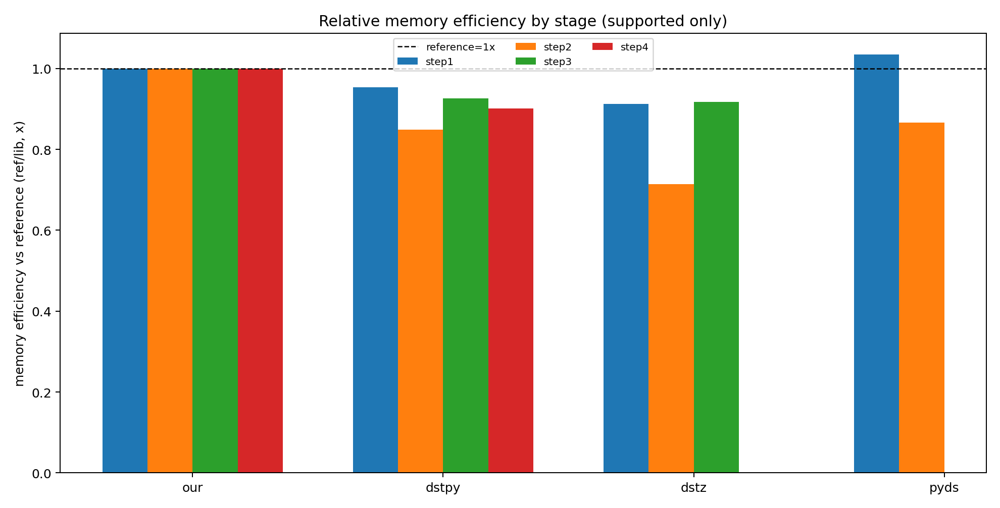

# Анализ результатов профилирования (интерпретация)

Источник: `results/profiling/processed_results/postprocessing_analysis/20260219_074831`.
Эталонная библиотека для сравнений: `our`.

## 1) Ключевые выводы

- **`our` — самый быстрый из библиотек с полным покрытием 4 этапов** (`step1..step4`):
  - `dstpy` медленнее на всех этапах (ускорение `our` относительно `dstpy`: ~`2.03x` на `step1`, `2.08x` на `step2`, `2.31x` на `step3`, `2.22x` на `step4`).
  - `dstz` особенно сильно проигрывает на `step2` и `step3` (ускорение `our`: ~`5.63x` и `8.71x` соответственно).
- **`pyds` нельзя корректно сравнить по полному пайплайну**, потому что он не поддерживает `step3` и `step4`. На `step1` он быстрее `our` (~`1.13x`), но на `step2` заметно медленнее (~`2.24x` в пользу `our`).
- По памяти **`our` — наиболее сбалансированный baseline**: у конкурентов чаще наблюдается перерасход в диапазоне `+5%..+40%` на поддерживаемых этапах, особенно у `dstz` на `step2`.

## 2) CPU: производительность по этапам

Все данные в этом анализе рассчитаны на основе **100 повторов выполнения каждого этапа** (в сводных таблицах: `mean_step_repeat_count=100` для всех библиотек).

По среднему времени на повтор (`mean_per_repeat_ms`):

- `our`: `46.16`, `19.91`, `38.45`, `23.48` мс (`step1..step4`).
- `dstpy`: `93.46`, `41.39`, `88.91`, `52.02` мс — медленнее `our` на каждом этапе.
- `dstz`: `70.97`, `112.05`, `334.88` мс на поддерживаемых этапах — выраженный провал на `step2/step3`.
- `pyds`: `40.89`, `44.55` мс на `step1/step2`; `step3/step4` отсутствуют.

Практически:
- Если нужен **полный 4-шаговый процесс**, `our` дает лучшее время end-to-end среди сопоставимых решений (`dstpy`, `dstz`).
- Если нужен только поднабор (`step1+step2`), у `pyds` есть локальное преимущество на `step1`, но уже на `step2` преимущество переходит к `our`.

## 3) Память: пиковое потребление

Сравнение по `mean_peak_mb`:

- `our`: `0.129`, `0.134`, `0.199`, `0.139` МБ.
- `dstpy`: выше baseline на `+4.8%`, `+17.8%`, `+7.9%`, `+10.9%`.
- `dstz`: выше baseline на `+9.6%`, `+40.0%`, `+9.0%` (поддерживаемые этапы).
- `pyds`: чуть лучше baseline на `step1` (`-3.4%`), но хуже на `step2` (`+15.5%`).

Вывод: по памяти `our` не имеет «пиковых аномалий» и остается стабильным ориентиром между этапами.

## 4) Узкие места по строкам кода (`our`)

Главные CPU-hotspots в `our` сосредоточены в `src/core/dempster_core.py`:

1. Проверка пересечения множеств в суммировании масс:
   - `line 43`: `subset.intersection(event_fs)` — крупнейший вклад на всех этапах.
2. Проверка включения подмножеств:
   - `line 38`: `subset.issubset(event_fs)` — второй по вкладу hotspot.
3. Вложенные циклы комбинирования BPA:
   - `line 60`, `line 50`, частично `line 113`.

Это типичный паттерн «много итераций + операции над `set/frozenset`». Основной резерв ускорения — уменьшение числа таких проверок или их стоимости.

## 5) Что оптимизировать в первую очередь

1. **Индексирование/кэш для запросов belief/plausibility** (`issubset`/`intersection`):
   - кэшировать преобразования `event -> frozenset` (частично уже есть),
   - кэшировать результаты для повторяющихся `event_fs` и/или шаблонов подмножеств,
   - рассмотреть предрасчет структуры индексов по фокальным элементам.
2. **Оптимизация двойных циклов комбинирования**:
   - ранние отсечения,
   - уплотнение представления гипотез,
   - сокращение количества временных объектов Python.
3. **Снизить аллокации в горячем пути**:
   - избегать лишних преобразований контейнеров в циклах,
   - аккуратно проверить, где создаются новые `frozenset` и dict-объекты.

## 6) Ограничения интерпретации

- **Неполное покрытие этапов:** у `pyds` не поддерживаются `step3` и `step4`, у `dstz` не поддерживается `step4`. Поэтому итоговые сравнения «в целом по пайплайну» корректны только между библиотеками с одинаковой поддержкой этапов.

## 7) Графики и как их читать

### 7.1 Абсолютные CPU-тайминги по этапам (`cpu_absolute_heatmap.png`)
Показывает абсолютные CPU-тайминги по этапам (мс): чем меньше значение, тем лучше. По карте сразу видно доминирование `our` на полном 4-этапном сценарии.

### 7.2 Относительное ускорение CPU к эталону (`cpu_relative_heatmap.png`)
Показывает относительное ускорение относительно `our` (`time_ref / time_lib`).
- `1.0x` — паритет с `our`.
- `<1.0x` — библиотека медленнее `our`.
- `>1.0x` — библиотека быстрее `our`.

### 7.3 Сгруппированный график ускорения CPU (`speedup_grouped_bar.png`)
Тот же относительный speedup по CPU, но в виде сгруппированных столбцов по этапам. Удобно сравнивать библиотеки внутри каждого этапа и видеть «провальные» шаги (например, `dstz` на `step2/step3`).

### 7.4 Абсолютные пиковые значения памяти (`memory_absolute_heatmap.png`)
Абсолютные пиковые значения памяти по этапам (МБ). Используется для оценки фактического memory footprint каждого решения.

### 7.5 Относительное потребление памяти к эталону (`memory_relative_heatmap.png`)
Относительное потребление памяти к эталону `our` (`lib / ref`).
- `1.0x` — паритет с `our`.
- `>1.0x` — библиотека потребляет больше памяти.
- `<1.0x` — библиотека потребляет меньше памяти.

### 7.6 Сгруппированная эффективность памяти (`memory_efficiency_grouped_bar.png`)
Памятная эффективность в виде `ref / lib`: чем выше столбец, тем эффективнее библиотека относительно `our` в данном этапе.

### 7.7 Узкие места по строкам для выбранной библиотеки (`line_bottlenecks_library_sorted_by_line.png`)
Построчные bottlenecks для выбранной библиотеки (в текущем наборе фокус: `our`), сортировка этап → файл → строка. График нужен для поиска первых кандидатов на оптимизацию в коде.

### 7.8 Подграфики построчных затрат по библиотекам (`line_timing_by_library_subplots.png`)
Подграфики по всем библиотекам с построчными затратами: удобно сравнивать профиль горячих строк между реализациями и понимать, где именно различаются вычислительные паттерны.

